# Building a Portable GSM cellular Network using NuandbladeRF
## Requirements
1. Linux Machine running SIGINT OS
2. Nuand BladeRF x40

## SigInt OS
SIGINT is an improved Linux distribution for Signal Intelligence. This distribution is based on Ubuntu Linux.  With this software, many SIGINT operations can be performed via a single graphical interface.

SigintOS is fully equiped with hardware dependencies that support Radio Device Hardware like HackRF, BladeRF, USRP and RTL-SDR hence eliminating software installation problems faced by many people interested in signal processing. Furthermore, most used Gnuradio, Gsm and Gps applications like Yate and yate-bts are also included in the distribution.

check https://www.sigintos.com/ for more information

### step 1
download and install sigintos from https://www.sigintos.com/ 

### step 2:Setting Up BladeRF
setup your Nuand BladeRF and connect it to the linux machine via a USB connection. At this point the Nuand BladeRF board will light one led as shown below
 

  

### step 3: Testing Hardware Compartibility
open the linux terminal and type
  > sudo dmesg 

if the bladeRF board is connected then the the version and hardware will be displayed as shown bellow

 
 

  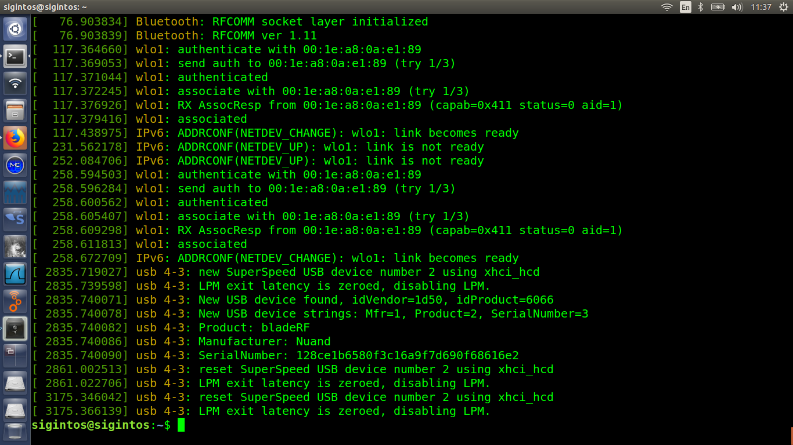

### step 4: Initializing NiPC web GUI
In order to access the yate NiPC web GUI open your browser and type
> localhost/main.php 
 

  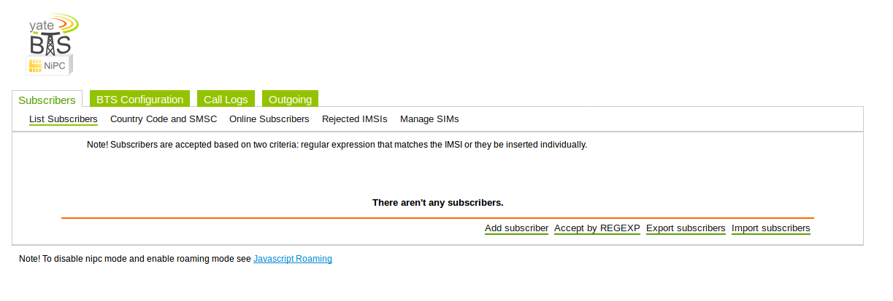

### step 5: Configuring Subscribers
open the Subscribers tab in the NiPC web GUI and set the subscribers to regexp*. This configuration disables GSM authentication hence any user will have access to the network

 

  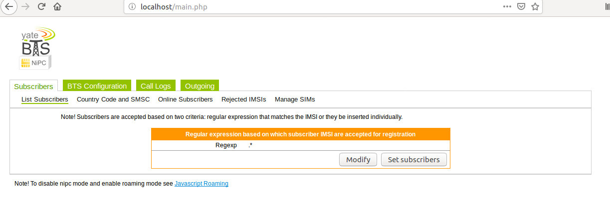

### step 6: Configuring Country Code
open Country Code and SMSC tab in under subscribers and modify it to your country code. This project was done in Kenya hence the Country code is set to 254 as shown bellow

 

  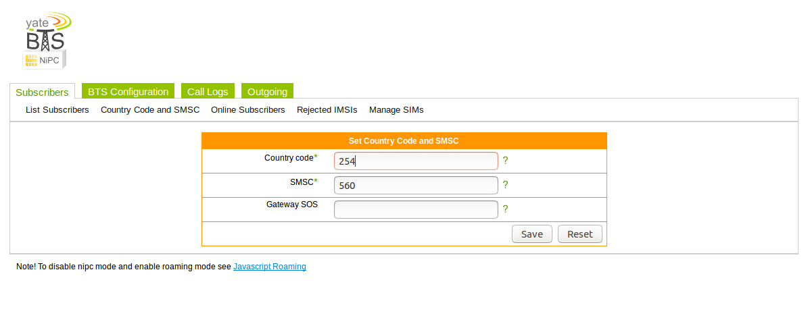

### step 7: GSM Configuration
1. Click on the GSM tab and select gsm.
2. configure it as shown below 
 

  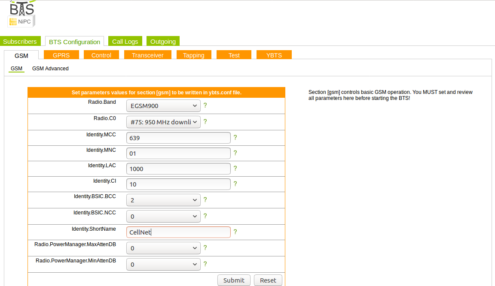

* The power is set to 0db in order to archive the maximun antenna power. 
* The mobile country code(MCC) should match your country's
here is a link to various mobile country codes in the world https://www.mcc-mnc.com/ 
* use the 01 as the MNC, it is the default for test networks worldwide 
* the identifier shortname is the name given to your network

### step 8: Configuring transceiver
Click on the Transceiver tab and set it to NuandbladeRF as shown below in order for yatebts to use the board as its transceiver

  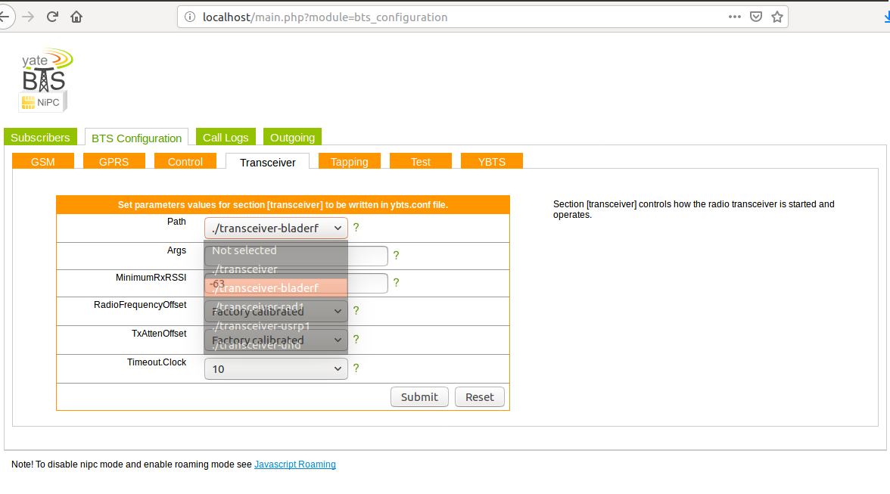

### step 9: Enabling GSM tapping
Click on the Tapping tab and enable gsm tapping as shown bellow. This configuration enables the bladeRF to tap into the GSM frequency band.

  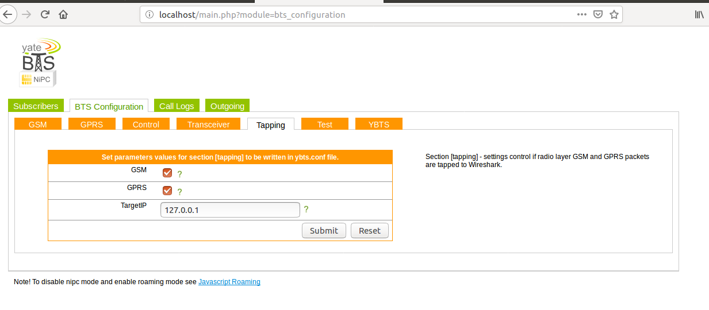

### step 10: Save the configuration

### step 11: Start yate bts
on the terminal type the command
> yate -s -vvv

In order to start yate bts. If everything is okay it will start and the network will be ready to connect to

The output shown below indicates yatebts is running well

  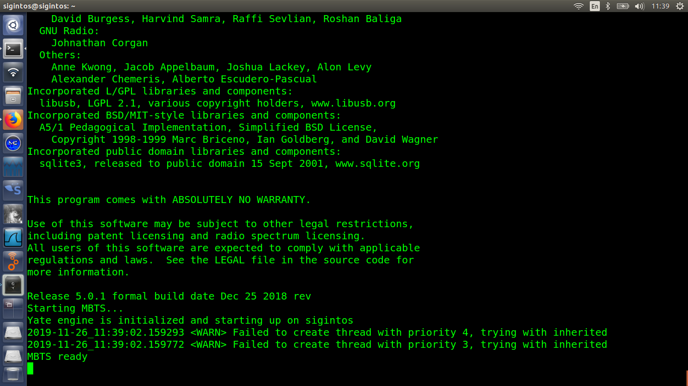

### step 12: Discovering the network
search for the network on your cellular device under the nwtwork setting. The network is identified by the MNC and MCC code set in the ybts configuration.In our case its 63901 as shown below.

  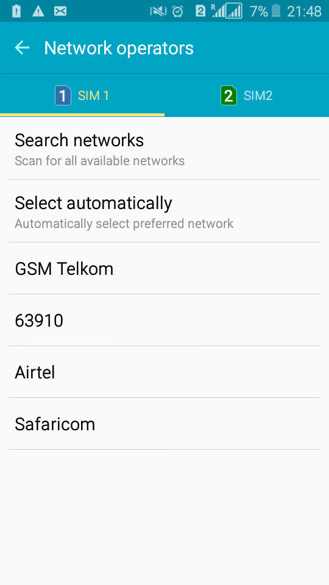

### step 13: Connecting to the YBTS network
click on the 63901 network option to register your cellphone to the YBTS network as shown below.

  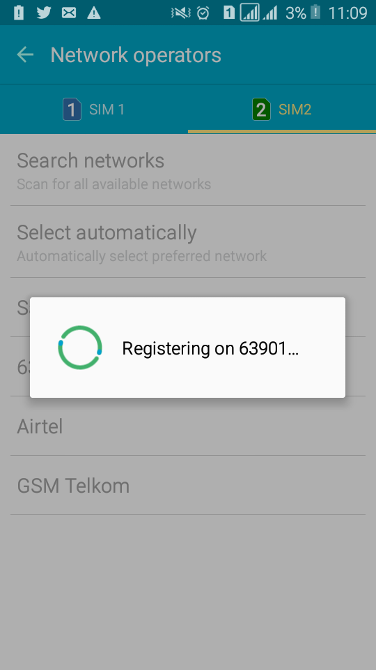

### step 14: Successfull registeration
Upon successfull registeration, Yatebts will assign you a phone number to use on the network. The registeration message also contains the numbers for sms and call test on the network as shown below.

  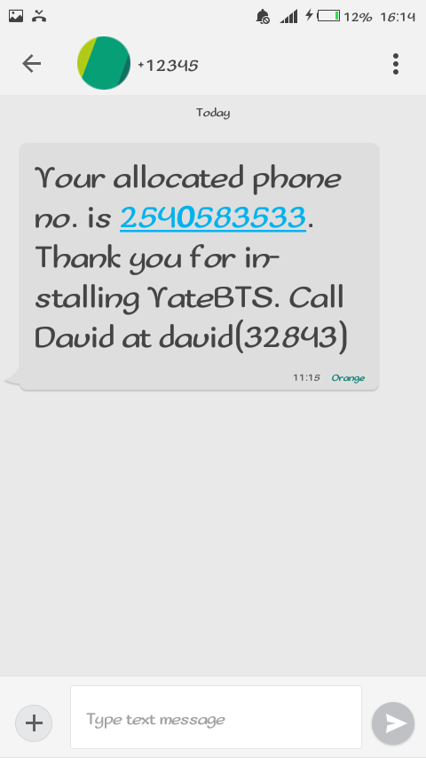

* you can register to phones in the network to test for SMS and Call services

### SMS Test
The figure below shows sms texts exchaged between two phones connected to yate bts

  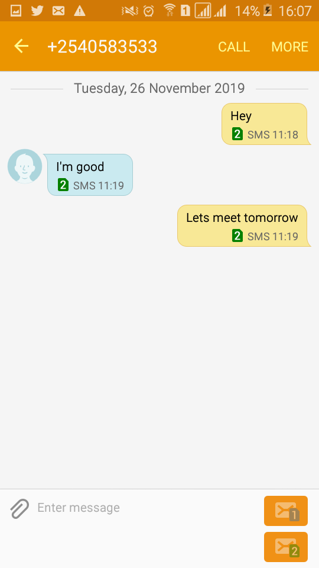

### Call Test
The figure below shows successfull call made between phones connected to the network

  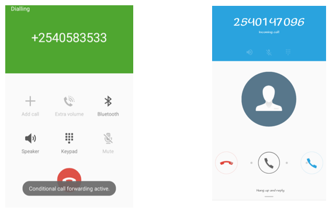

